<div align="center">



<a href="https://ginoarez.github.io"></a>
<a href="https://github.com/ginoarez"></a>

</div>

<br>

## About

Ingeniero industrial en formación (ITSLP, San Luis Potosí) y desarrollador autodidacta desde 2020.
Trabajo en el cruce entre **seguridad ofensiva/defensiva**, **sistemas de bajo nivel** y **producto móvil**:
desde drivers de kernel en Windows hasta apps publicadas en Google Play.

Prefiero construir cosas completas y enviarlas antes que acumular prototipos.
Todo lo que ves aquí salió de iniciativa propia, no de un ticket asignado.

```
Focus     →  Endpoint security · Static analysis · Mobile engineering
Stack     →  C++ · Rust · Python · Kotlin · Dart · TypeScript
Location  →  San Luis Potosí, México
Status    →  Open to collaboration
```

<br>

## Stack

**Systems & Security**


**Mobile**


**Backend & Web**


**Tooling**


<br>

## Activity

<div align="center">


<br><br>


<br><br>


</div>

<br>

## Projects

<table>
<tr>
<td width="50%" valign="top">

### MiniMythos
Plataforma antivirus / EDR-lite para Windows 10-11 x64.
Motor estático propio, driver de kernel, sandbox y backend en la nube.

`C++` `Rust` `Python` `Next.js`

<sub>Estado: pre-release — MVP en modo usuario</sub>

</td>
<td width="50%" valign="top">

### AirVox
App de automatización por voz y gestos publicada y monetizada en Google Play.
Modos AutoPilot, VoiceFlow y AirControl.

`Flutter` `Dart` `Gemini API` `RevenueCat`

<sub>Estado: publicada</sub>

</td>
</tr>
<tr>
<td width="50%" valign="top">

### Luciid
Restauración de fotos con IA. Arquitectura MVVM + Clean sobre backend propio de inferencia.

`Kotlin` `Jetpack Compose` `FastAPI` `Real-ESRGAN`

<sub>Estado: funcional</sub>

</td>
<td width="50%" valign="top">

### Prospecta
CRM SaaS para agencias, con scraping geográfico y pipeline asíncrono de tareas.

`FastAPI` `PostgreSQL` `Celery` `Next.js`

<sub>Estado: en desarrollo</sub>

</td>
</tr>
<tr>
<td width="50%" valign="top">

### wordsub_studio
Herramienta de escritorio que automatiza narración TTS y generación de subtítulos en un solo archivo.

`Python` `customtkinter` `ElevenLabs`

<sub>Estado: uso interno</sub>

</td>
<td width="50%" valign="top">

### Trading Systems
Indicadores y estrategias algorítmicas: detección OB/FVG/BOS y sistema Turtle sobre XAUUSD.

`Pine Script v6` `Indie v5`

<sub>Estado: iterando</sub>

</td>
</tr>
</table>

<br>

<div align="center">
<sub>github.com/ginoarez · ginoarez.github.io</sub>
</div>
